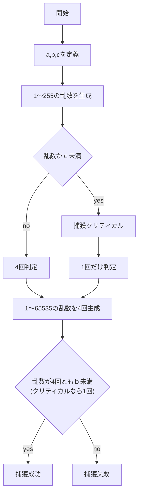
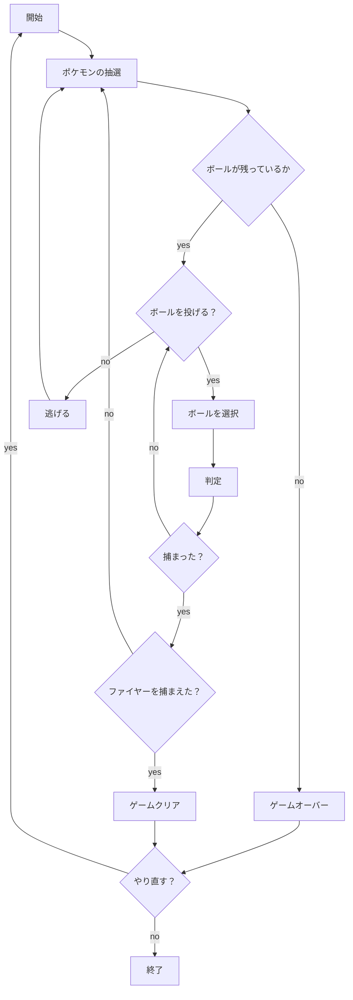

# webpro_06
2024, 11/15

## ポケモンゲットゲームについて
1. https://asa1729.github.io/webgame/ に入る
1. ランダムでポケモンが現れるので，使うボールを選択する．(モンスターボール，スーパーボール，ハイパーボール)
1. 捕獲の判定が行われ，成功すると捕まえたポケモンの数が増える．
1. 複数のポケモンを捕まえると「捕獲クリティカル」の確率が高まる．
1. ボールを使い切ってしまうとゲームオーバー
1. すべてのボールを使い切る前に伝説のポケモン「ファイヤー」を捕まえよう！

出現するポケモン | 特徴
-|-
ピカチュウ | 最も捕まえやすいポケモン
モココ | やや捕まえやすいポケモン
ニョロトノ | やや捕まえにくいポケモン．ボールを20回投げると出現するようになる．5匹以上捕まえたとき上昇するクリティカル補正が大きい
ダンバル | 捕まえにくいポケモン．ボールを20回投げると出現するようになる．5匹以上捕まえたとき上昇するクリティカル補正がとても大きい
ファイヤー | ボールを50回投げると出現するようになる．このポケモンを捕まえるとゲームクリア

### choose
ポケモンの抽選を行う関数．乱数の生成とともに投げたボールの数から出現させるポケモンを制限する．ボールを投げた回数が指定の数値に届かなかった場合はこの関数を再帰的に呼び出して再び抽選を行う．
```
function encount(corr, left){
  choose = Math.floor( Math.random() * 5 + 1 ); //1〜5の乱数をつくる
  if(choose == 1){  //捕捉率と最大HPを配列に代入する
    mon = 'ピカチュウ'; corr[0] = 255; corr[1] = 20; return choose;
  }
  else if(choose == 2){
    mon = 'モココ'; corr[0] = 190; corr[1] = 26; return choose;
  }
  else if(choose == 3 && (50 - left[0] + 30 - left[1] + 20 - left[2]) >= 30){   
    mon = 'ニョロトノ'; corr[0] = 120; corr[1] = 41; return choose;
  }   //ニョロトノとダンバルはボールを30回投げると現れるようになる
  else if(choose == 4 && (50 - left[0] + 30 - left[1] + 20 - left[2]) >= 30){
    mon = 'ダンバル'; corr[0] = 45; corr[1] = 52; return choose;
  }   //ボールを50回投げるとファイヤーが現れるようになる
  else if(choose == 5 && (50 - left[0] + 30 - left[1] + 20 - left[2]) >= 50){
    mon = 'ファイヤー'; corr[0] = 3; corr[1] = 165; return choose;
  }
  else{
    return encount(corr, left);   //再帰的関数にする
  }
}
```
## 捕獲判定
今回参考にした捕獲判定はポケモン3〜5世代で使用されていた計算方法である．都合上，原作とは異なる計算式となっている．

まず判定に使用する変数を定義
1. a = (最大HP×4096×捕捉率×ボール補正)÷(最大HP×3)
1. b = 65535÷√√(1044480÷a)
1. c = (b×クリティカル補正)÷(4096)


### 各種数値
捕捉率はポケモンごとに設定された捕まえやすさの指数である．捕捉率が大きいほど捕まえやすく，最大HPが高いほど捕まえにくい
ポケモン名 | 捕捉率 | 最大HP 
-|-|-
ピカチュウ | 255 | 20
モココ | 190 | 26
ニョロトノ | 120 | 40
ダンバル | 45 | 52
ファイヤー | 3 | 165

ボールごとに捕まえやすさが異なる．補正率が大きいほど捕まえやすいボールである
ボール名 | ボール補正 | 所持数
-|-|-
モンスターボール | 1 | 50
スーパーボール | 1.5 | 30
ハイパーボール | 2 | 20

ポケモンを捕まえた数に応じてクリティカル補正が上昇し捕獲クリティカルが起こりやすくなる．図鑑完成度と倒した数によってクリティカル率が上昇する原作ゲームを踏襲した．
条件 | クリティカル補正
-|-
初期値 | 0
ファイヤー以外を全て捕まえる(一度きり) | ＋1.5
ピカチュウまたはモココを5匹捕まえるごとに上昇 | ＋1.5
ニョロトノを5匹捕まえるごとに上昇 | ＋2.5
ダンバルを5匹捕まえるごとに上昇 | ＋3


### 全体の流れ

